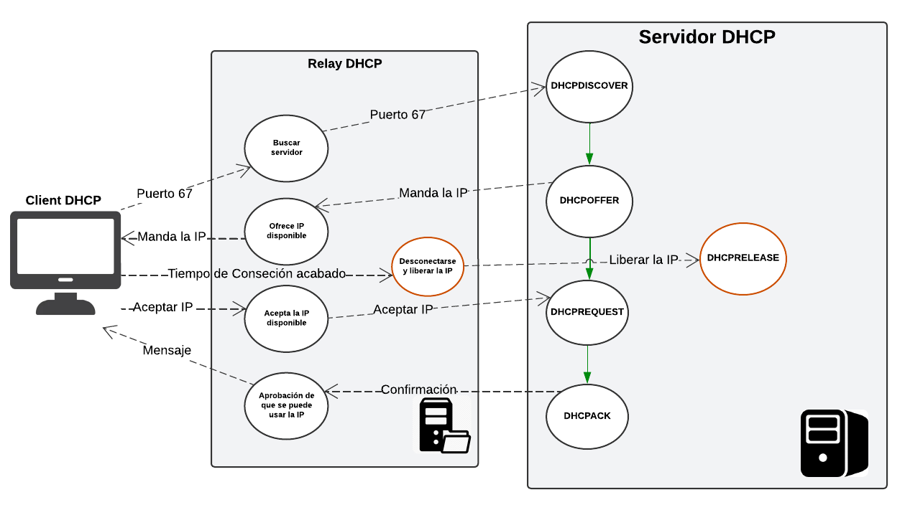

# Proyecto 01 Telemática: Implementación de Protocolo DHCP, Servidor y Cliente
## Introducción
El protocolo de Configuración Dinámica de Host (DHCP, por sus siglas en inglés), es un protocolo de red que permite a los dispositivos en una red obtener automáticamente una dirección IP y otros parámetros necesarios para su funcionamiento en la red. Es un protocolo basado en el modelo cliente-servidor, donde un servidor DHCP asigna dinámicamente las direcciones IP y demás parámetros de red a los clientes DHCP.

El objetivo de este proyecto es desarrollar un servidor DHCP en C, que pueda manejar las solicitudes de los clientes (también en C) que se conecten a la red, que solicite una dirección IP al servidor y que la pueda recibir correctamente. Para desarrollar el proyecto hicimos uso de la API Berkeley de sockets con la finalidad de que el servidor tenga una buena conexión y comunicación con el cliente. El servidor entrega varios parámetros al cliente, como una dirección IPv4, una máscara de subred, un default Gateaway, un DNS Server y duración de concesión (lease time).

## Desarrollo
### Servidor DHCP:
El servidor DHCP se desarrolló en C, donde el servidor se encarga de recibir solicitudes de los clientes para asignarles direcciones IP de manera automática. Adicionalmente, también proporciona parámetros esenciales como máscara de subred, gateaway, servidor DNS y la duración de la conexión (lease). El servidor maneja varias solicitudes simultáneamente y gestiona la renovación y liberación de las direcciones IP asignadas.
### Proceso DHCP:
**1. DHCPDISCOVER:** Cuando se conecta el cliente a la red, envía una solicitud para obtener una dirección IP de un servidor DHCP disponible.

**2. DHCPOFFER:** El servidor DHCP recibe la solicitud del cliente y envía la dirección IP y otros parámetros de configuración mencionados anteriormente

**3. DCHPREQUEST:** El cliente envía un mensaje para confirmar la dirección IP recibida.

**4. DHCPACK:** El servidor confirmar la asignación de la IP enviando un mensaje de DCHPACK (Acknowledgement), lo que le confirma al cliente que puede comenzar a usar la dirección IP asignada y demás parámetros de red.

### Cliente DHCP:
El cliente se desarrolló en C igualmente, este envía una solicitud al servidor para obtener una dirección IP que le permita conectarse a la red. Cuando el servidor se conecta a la vez, este muestra la información que le fue proporcionada por el servidor.

### Paquetes y librerías utilizadas:
**1. API Berkeley (Sockets):** Los sockets proporcionan la base para la comunicación entre el cliente y el servidor en la red. En el servidor, se utiliza unas direcciones AF_INET para IPv4 y el tipo de socket SOCK_DGRAM para la transmisión de paquetes usando el protocolo de transporte UDP (User Datagram Protocol). En el cliente, se establece un socket que envía y recibe mensajes para solicitar y recibir direcciones IP.
   
**2. Librerías en C:**
   - <arpa/inet.h>: Proporciona funciones para manipular direcciones IP, como inet_ntoa() y inet_pton(), que son necesarias para asignar y validar direcciones.
   - <pthread.h>: Permite el uso de hilos para manejar múltiples solicitudes de clientes simultáneamente.
   - <time.h>: Se utiliza para gestionar el tiempo de concesión (lease time) de las direcciones IP, lo cual facilita la renovación y expiración de las concesiones.
     
**3. Gestión de asignación y liberación de IPs:** El servidor usa un pool de direcciones IP que se asginan dinámicamente a los clientes cuando lo solicitan. Para cada dirección IP asignada, el servidor lleva un registro del tiempo de concesión y el estado de la dirección. Las funciones de asignación verifican el pool para identificar las direcciones disponibles, mientras que las funciones de liberación restauran las direcciones IP al pool para que otros clientes puedan utilizarlas.

## Diagrama UML

## Aspectos Logrados y No Logrados
### Aspectos Logrados:
Desarrollamos el servidor DHCP en C, que puede asignar direcciones IP dinámicamente a los clientes, puede manejar múltiples solicitudes simultáneamente por medio de sockets e hilos (librería <pthread.h>). Además, maneja todo el proceso del protocolo DHCP, los cuales son: DHCPDISCOVER, DHCPOFFER, DHCPREQUEST y DHCPACK, y envía todos los parámetros necesarios para la configuración de red (además de la dirección IP) como máscara de subred, un default gateaway y un servidor DNS. Maneja muy bien la duración de concesión (lease time) de las IPs asignadas, incluyendo la renovación y liberación de IPs cuando se necesite. Se logró implementar el servidor y el cliente en una instancia de AWS.

### Aspectos no logrados:
No se ha logrado ejecutar el proyecto en una máquina virtual.

## Conclusiones
- El proyecto nos proporcionó un muy buen aprendizaje en la implementación y diseño de aplicaciones de red, en este caso del protocolo DHCP, en donde se implementó la asignación dinámica de direcciones IP, la renovación de las concesiones y la liberación de direcciones. 
- Además se usó la API Berkeley de sockets para la comunicación entre el servidor y el cliente.
- Se uso también hilos (pthreads) para el manejo de las solicitudes simultáneamente.
- Se realizó el manejo del flujo de mensajes del protocolo de DHCP.
- Se implementó los demás parámetros necesarios para la configuración de redes.
- Finalmente, se desplegó el servidor y el cliente en AWS para ejecutar el proyecto en la nube.

## Referencias
https://ubuntu.com/tutorials/how-to-run-ubuntu-desktop-on-a-virtual-machine-using-virtualbox#3-install-your-image

https://www.youtube.com/watch?v=Hjbc7GEKg5s&t=117s

https://www.youtube.com/watch?v=e6-TaH5bkjo&t=451s

https://www.cisco.com/c/es_mx/support/docs/ip/dynamic-address-allocation-resolution/22920-dhcp-ser.html#configs

